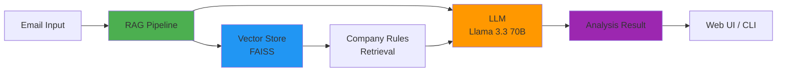

# 🛡️ PhishGuard AI

**Production-Ready Phishing Email Detection System using RAG Technology**

[](https://www.python.org/downloads/)
[](https://streamlit.io/)
[](LICENSE)

PhishGuard AI is an intelligent email security analyzer that uses Retrieval-Augmented Generation (RAG) to detect phishing attempts based on your company's specific security policies. Built with LangChain, Groq's Llama 3.3, and FAISS vector database.


## ✨ Features

- 🧠 **RAG-Powered Analysis**: Combines company-specific rules with LLM intelligence
- 🎯 **Context-Aware Detection**: Analyzes emails against your organization's security policies
- 📊 **Risk Assessment**: Provides detailed threat levels and recommendations
- 🌐 **Web Interface**: Beautiful Streamlit dashboard for easy analysis
- 💻 **CLI Tools**: Command-line interfaces for automation and scripting
- 📝 **Production-Ready**: Comprehensive logging, error handling, and configuration management
- 🔒 **Secure**: Environment-based API key management
- ⚡ **Fast**: Cached vector database for optimal performance

## 🏗️ Architecture



### System Components

1. **Vector Database (FAISS)**: Stores company security policies as embeddings
2. **Embedding Model**: HuggingFace Sentence Transformers for semantic search
3. **LLM Engine**: Groq's Llama 3.3 (70B) for intelligent analysis
4. **RAG Pipeline**: Retrieves relevant rules and augments LLM prompts
5. **Web Interface**: Streamlit dashboard for user-friendly interaction
6. **CLI Tools**: Command-line scripts for automation

## 📋 Prerequisites

- Python 3.8 or higher
- Groq API Key ([Get one here](https://console.groq.com/keys))
- 2GB+ RAM for embedding models
- Internet connection (first-time model download)

## 🚀 Installation

### 1. Clone the Repository

```bash
git clone https://github.com/utkankeser/PhishGuard-AI.git
cd PhishGuard-AI
```

### 2. Create Virtual Environment

```bash
# Windows
python -m venv .venv
.venv\Scripts\activate

# Linux/Mac
python3 -m venv .venv
source .venv/bin/activate
```

### 3. Install Dependencies

```bash
pip install -r requirements.txt
```

### 4. Configure Environment Variables

```bash
# Copy the example environment file
cp .env.example .env

# Edit .env and add your Groq API key
# GROQ_API_KEY=your_actual_api_key_here
```

**Get your Groq API key**:
1. Visit [console.groq.com](https://console.groq.com/keys)
2. Sign up/login
3. Create a new API key
4. Copy it to your `.env` file

### 5. Initialize Vector Database

```bash
python rag_setup.py
```

This will:
- Download the embedding model (first-time only, ~90MB)
- Create the FAISS vector database with company rules
- Validate the database setup

## 💡 Usage

### Web Interface (Recommended)

```bash
streamlit run app.py
```

Then open your browser to `http://localhost:8501`

**Features**:
- 📝 Paste email content for analysis
- 🎯 View risk levels and detailed reports
- 📚 See which company rules were triggered
- ⚙️ System status monitoring
- 🔐 API key can be set via UI or environment

### Command-Line Interface

#### RAG-Based Analysis

```bash
# Use default test email
python phish_guard_rag.py

# Analyze custom email
python phish_guard_rag.py --email "From: ceo@example.com..."

# JSON output for automation
python phish_guard_rag.py --json

# Provide API key via CLI
python phish_guard_rag.py --api-key gsk_xxx --email "..."
```

#### Basic Phishing Detection

```bash
# Without RAG (general phishing indicators only)
python phish_guard.py

# Custom email
python phish_guard.py --email "Your email content..."
```

## 📁 Project Structure

```
PhishGuard-AI/
├── app.py                  # Streamlit web application
├── phish_guard_rag.py      # RAG-based CLI analyzer
├── phish_guard.py          # Basic CLI analyzer
├── rag_setup.py            # Vector database setup
│
├── config.py               # Configuration management
├── logger.py               # Logging system
├── exceptions.py           # Custom exceptions
│
├── .env.example            # Environment variables template
├── .env                    # Your actual config (git-ignored)
├── requirements.txt        # Python dependencies
├── .gitignore             # Git ignore rules
│
├── logs/                   # Application logs (auto-created)
│   ├── app.log
│   ├── phish_guard_rag.log
│   └── rag_setup.log
│
└── sirket_vektor_db/      # FAISS vector database (created by rag_setup.py)
    ├── index.faiss
    └── index.pkl
```

## ⚙️ Configuration

All configuration is managed through environment variables in `.env`:

```env
# Required
GROQ_API_KEY=your_groq_api_key_here

# Model Configuration (Optional - defaults provided)
EMBEDDING_MODEL_NAME=sentence-transformers/all-MiniLM-L6-v2
LLM_MODEL_NAME=llama-3.3-70b-versatile
LLM_TEMPERATURE=0.0

# Database Configuration
VECTOR_DB_PATH=sirket_vektor_db

# Logging
LOG_LEVEL=INFO          # DEBUG, INFO, WARNING, ERROR, CRITICAL
LOG_DIR=logs

# RAG Settings
RAG_TOP_K=2            # Number of rules to retrieve
```

## 📊 Logging

Logs are automatically created in the `logs/` directory:

- **Console**: Color-coded output (INFO and above)
- **Files**: Rotating log files (max 10MB, 5 backups)
- **Format**: Timestamp | Level | Module | Function | Message

Example log entry:
```
2025-12-29 00:10:23 | INFO     | phish_guard_rag | analyze_email:87 | Starting email analysis...
```

## 🔧 Error Handling

The application uses custom exception hierarchy:

- `PhishGuardError`: Base exception
- `ConfigurationError`: Missing/invalid configuration
- `VectorStoreError`: Vector database issues
- `LLMError`: LLM/API problems
- `EmbeddingError`: Embedding model issues

All errors provide detailed messages and logging for easy troubleshooting.

## 🚨 Troubleshooting

### "Vector database not found"
**Solution**: Run `python rag_setup.py` to create the database.

### "API key not configured"
**Solution**: Add your Groq API key to `.env` file.

### "Failed to load embedding model"
**Solution**: 
- Check internet connection
- Ensure you have ~2GB free RAM
- On first run, model download may take a few minutes

### "LLM request failed"
**Solution**:
- Verify API key is correct
- Check you have API credits at [console.groq.com](https://console.groq.com)
- Check internet connection

### Logs show import errors
**Solution**: Reinstall dependencies
```bash
pip install -r requirements.txt --upgrade
```

## 🛣️ Roadmap

- [x] Production-ready configuration management
- [x] Comprehensive logging system
- [x] Error handling and validation
- [x] Web and CLI interfaces
- [ ] REST API endpoint
- [ ] Multi-language support
- [ ] Email header analysis (SPF/DKIM)
- [ ] URL scanning integration
- [ ] PDF report generation
- [ ] Docker containerization
- [ ] Advanced threat intelligence
- [ ] Quarantine system
- [ ] Admin dashboard with analytics

## 🤝 Contributing

Contributions are welcome! Please:

1. Fork the repository
2. Create a feature branch (`git checkout -b feature/amazing-feature`)
3. Commit your changes (`git commit -m 'Add amazing feature'`)
4. Push to the branch (`git push origin feature/amazing-feature`)
5. Open a Pull Request

## 📄 License

This project is licensed under the MIT License - see the [LICENSE](LICENSE) file for details.

## 🙏 Acknowledgments

- [LangChain](https://langchain.com/) for the RAG framework
- [Groq](https://groq.com/) for ultra-fast LLM inference
- [Streamlit](https://streamlit.io/) for the web interface
- [HuggingFace](https://huggingface.co/) for embedding models
- [FAISS](https://github.com/facebookresearch/faiss) for vector search

## 📞 Support

- 🐛 Issues: [GitHub Issues](https://github.com/utkankeser/PhishGuard-AI/issues)
- 💬 Discussions: [GitHub Discussions](https://github.com/utkankeser/PhishGuard-AI/discussions)

## ⭐ Show Your Support

If this project helped you, please give it a ⭐️ on GitHub!

---

**Made with ❤️ by Utkan Keser**
